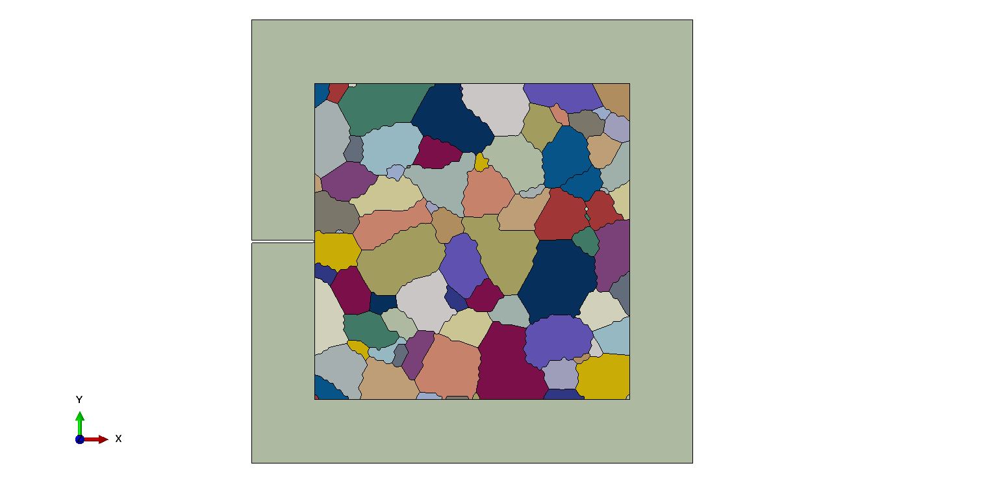

# EBSD2AbaqusGeo
Abaqus script for generating Abaqus geometry model from EBSD data.
To get finite model from EBSD data, I tried Dorian's [MTEX2Gmsh toolbox](https://github.com/DorianDepriester/MTEX2Gmsh) but its mesh based on [Gmsh](http://gmsh.info/) and the mesh is not convenient to modify. So I export the .geo file by [MTEX2Gmsh](https://github.com/DorianDepriester/MTEX2Gmsh) and transform it into geometry model in Abaqus.

## Note ##
Two scripts was written for my post-graduate project, so I don't update function of scripts in the future unless which is necessarily to my project. This is my first time to update files in Github, I hope to make some friends in this platform.

## Geo2Abaqus ##
This script is for generating Abaqus geometry model from .geo file. You can obtain .geo file from EBSD data by using [MTEX2Gmsh toolbox](https://github.com/DorianDepriester/MTEX2Gmsh).

## Neper2Abaqus ##
If you don't have EBSD data, you can also get texture information from .tess file generated by open source software [Neper](https://neper.info/index.html).

## Example ##
This is a example of Single-Edge notched tensile specimen with textured region contact the crack tip.

